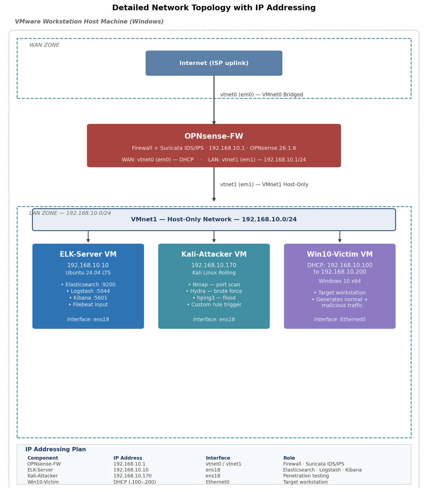

# Network Intrusion Detection Platform using OPNsense, Suricata & ELK Stack

<p align="center">


</p>

---

## Project Overview

This project presents the design and implementation of a **Network Intrusion Detection and Monitoring Platform** built entirely with open-source technologies.

The platform combines:

- **OPNsense** as the firewall and network gateway
- **Suricata IDS** for real-time intrusion detection
- **Elastic Stack (ELK)** for centralized log management and visualization
- **Telegram Bot API** for instant security notifications

The entire infrastructure was deployed in a virtual laboratory using **VMware Workstation** and validated through multiple penetration testing scenarios performed with Kali Linux.

The objective is to provide a lightweight Security Operations Center (SOC)-like environment capable of monitoring network traffic, detecting malicious activities, visualizing security events, and notifying administrators in real time.

---

# Project Highlights

- Real-time network traffic inspection
- Open-source SOC architecture
- Intrusion Detection with Suricata
- Centralized log collection
- Elasticsearch indexing
- Logstash processing pipelines
- Kibana dashboards
- Custom Suricata detection rules
- Telegram alert automation
- Multiple attack simulations
- VMware virtual laboratory
- MITRE ATT&CK mapping
- Cyber Kill Chain analysis

---

# Architecture

> Replace the image below with your architecture diagram.

<p align="center">



</p>

---

# Infrastructure

The laboratory environment consists of four virtual machines.

| Machine | Operating System | Purpose |
|----------|-----------------|----------|
| OPNsense | OPNsense 26.1.6 | Firewall + IDS |
| ELK Server | Ubuntu Server 24.04 LTS | Elasticsearch + Logstash + Kibana |
| Kali Linux | Kali Rolling | Attack Simulation |
| Windows 10 | Windows 10 | Victim Machine |

---

# Technology Stack

| Category | Technology |
|-----------|------------|
| Firewall | OPNsense |
| IDS | Suricata |
| Search Engine | Elasticsearch |
| Log Processing | Logstash |
| Visualization | Kibana |
| Operating System | Ubuntu Server 24.04 |
| Virtualization | VMware Workstation |
| Notifications | Telegram Bot API |
| Testing | Kali Linux |
| Victim | Windows 10 |

---

# Detection Workflow

```
Internet

      │

      ▼

OPNsense Firewall

      │

      ▼

Suricata IDS

      │

Detects Security Events

      │

      ▼

Logstash

      │

Processes Logs

      ▼

Elasticsearch

      │

Indexes Events

      ▼

Kibana

      │

Dashboards

      ▼

Telegram Alerts
```

---

# Features

### Network Security

- Stateful firewall
- Network segmentation
- Traffic monitoring
- Intrusion Detection
- Custom Suricata signatures

### SIEM

- Centralized log collection
- Event normalization
- Elasticsearch indexing
- Kibana dashboards
- Security event visualization

### Alerting

- Telegram Bot integration
- Instant notifications
- Critical attack alerts

### Testing

- Nmap scans
- Hydra SSH brute force
- ICMP flood detection
- Custom IDS rule validation

---

# Repository Structure

```
Intrusion-Detection-Platform-OPNsense-Suricata-ELK
│
├── configs/
│
├── diagrams/
│
├── docs/
│   ├── INSTALLATION.md
│   ├── ARCHITECTURE.md
│   ├── CONFIGURATION.md
│   ├── ATTACK_SIMULATIONS.md
│   ├── DASHBOARDS.md
│   ├── TELEGRAM_ALERTS.md
│   └── PFE_Report.pdf
│
├── images/
│
├── rules/
│
├── scripts/
│
├── README.md
│
├── LICENSE
│
└── .gitignore
```

---

# Attack Scenarios

The platform has been validated using several penetration testing techniques.

| Attack | Tool | Detection |
|---------|------|-----------|
| Port Scan | Nmap | Suricata |
| SSH Brute Force | Hydra | Suricata |
| ICMP Flood | Ping | Suricata |
| Custom Signature | Custom Rule | Suricata |

---

# Dashboards

Kibana dashboards provide:

- Network events
- Source IP statistics
- Destination IP statistics
- Alert severity
- Top attack signatures
- Timeline analysis
- Protocol distribution

Example screenshots are available inside:

```
images/dashboards/
```

---

# Telegram Notifications

Whenever a critical Suricata alert is generated, a notification is automatically sent to Telegram.

Example:

```
⚠️ Intrusion Detected

Rule:
ET SCAN Nmap

Source:
192.168.100.20

Destination:
192.168.100.10

Priority:
High

Timestamp:
2026-05-18 21:41:12
```

---

# Project Documentation

Detailed documentation is available inside the **docs** directory.

| Document | Description |
|----------|-------------|
| INSTALLATION.md | Installation guide |
| ARCHITECTURE.md | Platform architecture |
| CONFIGURATION.md | Component configuration |
| ATTACK_SIMULATIONS.md | Penetration testing |
| DASHBOARDS.md | Kibana dashboards |
| TELEGRAM_ALERTS.md | Telegram integration |

---

# Future Improvements

Future versions may include:

- Zeek Network Security Monitor
- Wazuh SIEM integration
- Elastic Security
- Sigma rule support
- MITRE ATT&CK dashboards
- Docker deployment
- High Availability architecture
- Machine Learning anomaly detection

---

# Learning Objectives

This project demonstrates practical experience with:

- Network Security
- Security Monitoring
- Intrusion Detection Systems
- SIEM Platforms
- Log Analysis
- Firewall Administration
- Linux Administration
- VMware Virtualization
- Incident Detection
- SOC Operations

---

# Author

**Imane Erraji**

Engineering Student

Network & Systems Security

École Nationale des Sciences Appliquées (ENSA)

Morocco

---

# License

This project is licensed under the MIT License.

See the **LICENSE** file for more information.

---

## Acknowledgments

Special thanks to:

- ENSA Berrechid
- BakerTilly Consulting Casablanca
- The Open-Source Cybersecurity Community
- OPNsense Project
- Suricata Project
- Elastic Stack Community

---

> **Disclaimer**
>
> This project was developed for educational and research purposes in a controlled laboratory environment. All attack simulations were performed on isolated virtual machines owned and managed by the project author.
