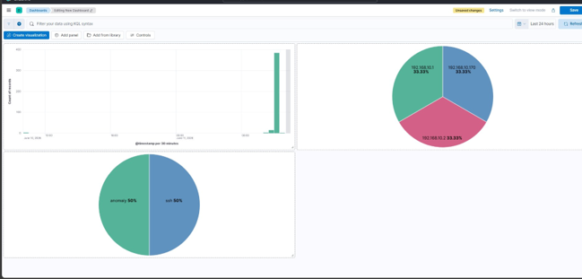

# 🛡️ Network Intrusion Detection Platform using OPNsense, Suricata and ELK Stack


A virtualized Network Intrusion Detection and Security Monitoring Platform developed as a Final Year Project (PFE). The platform combines **OPNsense**, **Suricata IDS**, and the **Elastic Stack (Elasticsearch, Logstash, and Kibana)** to detect, centralize, analyze, and visualize security events in real time. A Telegram notification system provides instant alerts for critical events.

---

# 📌 Project Overview

Modern organizations require continuous monitoring of their networks to detect malicious activities before they become security incidents. This project demonstrates how an entirely open-source security monitoring platform can be deployed in a virtualized environment.

The platform captures network traffic, detects attacks using Suricata IDS, processes security events with Logstash, stores them in Elasticsearch, visualizes them in Kibana dashboards, and automatically sends Telegram notifications for critical alerts.

---

# 🏗️ Platform Architecture

> Replace the image below with your final architecture diagram.


---

# 🚀 Features

- OPNsense Firewall Configuration
- Suricata Intrusion Detection System (IDS)
- Custom Detection Rules
- Centralized Log Collection
- Log Processing with Logstash
- Elasticsearch Indexing
- Kibana Dashboards
- Real-Time Security Monitoring
- Telegram Alert Notifications
- Nmap Attack Detection
- ICMP Detection
- SSH Brute Force Detection
- VMware Virtual Laboratory

---

# 🖥️ Virtual Laboratory

| Virtual Machine | Operating System | Purpose |
|-----------------|------------------|----------|
| OPNsense | OPNsense 26.1.6 | Firewall & Gateway |
| ELK Server | Ubuntu Server 24.04 LTS | Elasticsearch, Logstash, Kibana |
| Kali Linux | Kali Rolling | Attack Simulation |
| Windows 10 | Windows 10 | Victim Machine |

---

# ⚙️ Technologies Used

| Category | Technology |
|----------|------------|
| Firewall | OPNsense 26.1.6 |
| IDS | Suricata |
| SIEM | Elasticsearch 8.19.16 |
| Log Processing | Logstash 8.19.16 |
| Dashboard | Kibana 8.19.16 |
| Operating System | Ubuntu Server 24.04 LTS |
| Virtualization | VMware Workstation |
| Attacker Machine | Kali Linux |
| Victim Machine | Windows 10 |
| Notifications | Telegram Bot API |

---

# 📂 Repository Structure

```
Intrusion-Detection-Platform-OPNsense-Suricata-ELK
│
├── README.md
├── LICENSE
├── .gitignore
│
├── configs/
│   ├── elasticsearch.yml
│   ├── kibana.yml
│   ├── logstash.conf
│   ├── suricata.yaml
│   └── telegram-alert.service
│
├── docs/
│   ├── INSTALLATION.md
│   ├── ARCHITECTURE.md
│   ├── CONFIGURATION.md
│   ├── ATTACK_SIMULATIONS.md
│   ├── DASHBOARDS.md
│   ├── CUSTOM_RULES.md
│   ├── TELEGRAM_ALERTS.md
│   ├── PERFORMANCE.md
│   └── TROUBLESHOOTING.md
│
├── diagrams/
├── images/
├── rules/
└── scripts/
```

---

# 🔥 Attack Workflow

```
Attack
      │
      ▼
 Suricata IDS
      │
      ▼
   Logstash
      │
      ▼
 Elasticsearch
      │
      ▼
    Kibana
      │
      ▼
Telegram Alert
```

---

# 📊 Screenshots

## Network Topology


---

## OPNsense Dashboard


---

## Kibana Dashboard



---

## Kibana Discover


---

## Telegram Alert


---

# 📈 Project Results

The implemented platform successfully demonstrated the following capabilities:

- Detection of ICMP traffic
- Detection of SSH connection attempts
- Detection of Nmap reconnaissance
- Centralized log collection
- Security event visualization
- Real-time Telegram notifications
- Continuous monitoring of network traffic
- Efficient analysis through Kibana dashboards

---

# 📖 Documentation

Detailed documentation is available in the `docs/` directory.

| Document | Description |
|----------|-------------|
| INSTALLATION.md | Installation Guide |
| ARCHITECTURE.md | Platform Architecture |
| CONFIGURATION.md | System Configuration |
| ATTACK_SIMULATIONS.md | Attack Scenarios |
| DASHBOARDS.md | Kibana Dashboards |
| CUSTOM_RULES.md | Suricata Rules |
| TELEGRAM_ALERTS.md | Telegram Integration |
| PERFORMANCE.md | Performance Evaluation |
| TROUBLESHOOTING.md | Common Issues |

---

# ⚡ Quick Start

Clone the repository:

```bash
git clone https://github.com/imane-erraji/Intrusion-Detection-Platform-OPNsense-Suricata-ELK.git
```

Configure:

- OPNsense
- Suricata IDS
- Logstash
- Elasticsearch
- Kibana

Import the provided configurations and custom rules.

Run the attack simulations described in `ATTACK_SIMULATIONS.md`.

Open Kibana and monitor the generated events.

---

# 📌 Future Improvements

- Docker Deployment
- High Availability Architecture
- Threat Intelligence Integration
- Email Notifications
- Machine Learning-Based Detection
- Automated Incident Response

---

# 👩‍💻 Author

**Imane Erraji**

Engineering Student – Network & Systems Security

École Nationale des Sciences Appliquées (ENSA)

Morocco

---

# ⭐ Support

If you found this project useful, consider giving it a **⭐ Star** on GitHub.
